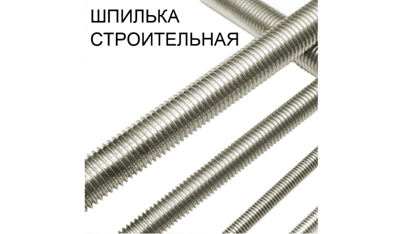

# Самодельный стартостат. Сезон 2023. Vostok-6


> Безумие — это точное повторение одного и того же действия, раз за разом, в надежде на изменение

Команда проекта "Восток" снова на связи и привезла вам *парочку* космических видосов! В этот раз мы почти ничего не меняли по технической части, так что сосредоточимся на результатах и поисках. Думаю после всего того, что мы натворили, мы, как минимум, можем считаться крупнейшими поставщиками 4k-контента из стратосферы на территории РФ. Приготовьте свои интернет каналы, будет много фото и видео.

Поехали!

## Дисклеймер


Быстрое напоминание/ввод в курс дела для тех кто подзабыл эту историю или видит все это впервые - мы собираем и запускаем свои стратосферные зонды и записываем полет на камеру. В полете мы собираем некоторые данные с разных датчиков и потом выкладываем это на всеобщее обозрение. Цель мероприятия - облегчить задачу людям, которые захотят сделать нечто подобное. В моем профиле вы найдете серию статей, где я по пунктам описывал как и что мы делали, включая согласование с контролирующими органами.

В этот раз я постараюсь все ужать до минимума и обходиться без видео в тексте. Но про видео будет отдельное объявляение в разделе "Видео".

## Vostok-5 vs. Vostok-6

Итак, что же изменилось с прошлого раза? Да почти ничего! Мы немного поработали над парашютом, я исправил 1 баг в ПО и добавил 1 новый, в общем - почти копия. **Важное** отличие - фал. Точнее фал от парашюта, до шара. В этот раз сделали его **5 метров**. Напомню: в прошлый раз остатки шара взрывом загнало под купол парашюта и это препятствовало его (парашюта) нормальной работе. Фактически наша полезная нагрузка просто упала с 36км на землю. Посмотреть на это можно [тут](https://youtu.be/XqSF5Ff3QZM?t=8712), почитать [тут](https://pikabu.ru/story/samodelnyiy_stratostat_sezon_2022_vostok5_9198647?utm_source=linkshare&utm_medium=sharing)

Второе важное отличие - в этот раз шаров было сразу 2! Нет-нет, это не значит что мы одну коробку прицепили к двум шарам (смысл?), мы собрали брата-близнеца нашего основного зонда и оба запустили за раз. Шары были по 1кг.

Сразу определимся с названиями и ролями зондов.

**Vostok-6a** - основной и наш любимый. У него на борту наш полный стандартный комплект оборудования:
- RPI 4B + GPS HAT + SenseHat
- Insta360 в качестве бортовой камеры
- 2 павербанки для питания
- Spot Trace в качестве поискового трекера

Как вы могли заметить - мы убрали дисплей с выводом телеметрии, потому что это был провал (опять же здесь и далее повторяться не буду - это описано в посте про Vostok-5). Но мне есть чем вас порадовать. Об этом в разделе про видео.

**Vostok-6b** - собрали "из того что осталось". Наш нелюбимый, второй ребенок в семье. Он состоит из:
- RPI 4B + GPS HAT
- GoPro 7 Black
- 2 павербанки
- "Азимут Иридиум" в качестве поискового трекера

Также мы разместили камеры на выносной мачте, которая крепилась к каркасу из пластиковых водопроводных труб. Для Insta360 это дало обзор получше, для GoPro7 это дало обзор на парашют и шар (а мы хотели заснять работу парашюта). Выглядело это так:


Компоновка компонентов внутри боксов и схема самих боксов - стандартная, как в прошлых запусках. 


## Предполетная подготовка и запуск

> Адрес сайта для регистрации оператора зонда и подачи планов изменился. Теперь он такой: https://sppi.ivprf.ru/

Как обычно: за 5 дней до планируемого запуска подали полетный план. Кстати, вот он:
```
(SHR-ZZZZZ
-ZZZZ0900
-K0300M3000
-DEP/5850N03325E DOF/230611 OPR/ИВАНОВ ИВАН ИВАНОВИЧ +79311234567 my.sky@gmail.com TYP/SHAR RMK/ОБОЛОЧКА 300 ДЛЯ ЗОНДИРОВАНИЯ АТМОСФЕРЫ SID/VSTK0160)
```

Это снова наш любимый поселок Любытино. Мы оттуда запускались много раз - там всегда без проблемы выдают разрешение и там удобная полянка окруженная лесом, который защищает от ветра.


С разрешением на этот раз понервничали. Как я рассказывал ранее: то что у вас приняли полетный план - еще не значит что вам разрешили вылет. Вылет вам разрешат не ранее чем за час от времени указанного в плане - голосом по телефону. Так воооот... ОрВД по звонку за 2 часа до вылета сказала нам: ждите, сводки погоды еще нет. Потом за час сказала то же самое. А у нас как бы план - запустить и успеть найти в тот же день (припоминая опыт ночевки в придорожных мотелях). Мы все же решили "преднакачать" шары и закрепить их за фалы на земле, пока ожидаем отмашки от ОрВД. И вот только после 3го звонка (за полчаса до вылета) мы услышали в трубке заветное "разрешаем использование воздушного пространства". В остальном предполетная рутина прошла без сюрпризов.


Если кто не верит, вот пруф:

[](https://youtu.be/TN_y6MGwDhI)

## Поиск и спасение

Ну а тут, как это часто у нас бывает, пришлось выдумывать какую-то дичь. Поисковые трекеры как обычно "не ало", но мы уже привыкшие. Spot отозвался часов через 5 после старта сам. Азимут не отзывался совсем ¯\\\_(ツ)\_/¯ Но, звонками в саппорт и каким-то чудом удалось оживить его удаленно. Нам сказали, что у него был отключен спутниковый канал передачи данных из-за простоя. Ну, допустим.

Тем не менее, координаты приземления мы получили для Vostok-6b (Spot Trace) раньше и отправились смотреть его.

### Vostok-6b


Отлетел на 50км по прямой. Местность - какой-то лесок. На спутниковых картах "вроде как" лежит на опушке. Легкая прогулочка, тем более что у нас есть вот этот парень:


От места высадки до точки приземления было всего ничего, да и местность - просто поле.


Поле для нашего вездехода не страшно. Плюс мы загрузили все необходимы инструменты, оборудование и т.п. и думали, что готовы ко всему... Но к такому мы не были готовы (осторожно - мат):

[](https://www.youtube.com/watch?v=M8rKQkKHYKg&ab_channel=Vostok)

Нда... Эту елку нам не победить - это было ясно всем. Еще меня поразило насколько нам "повезло" - это было буквально последнее высокое дерево перед опушкой по траектории движения зонда. Пролети он на метр выше - приземлился бы на опушке, как порядочный зонд.

Идеи были разные, от "шмальнуть из ружья" до "нужны монтажные кошки и сейчас за ним полезем". Предприняли робкие попытки залезть на это дерево - тщетно. Оно наполовину сухое и не понятно какая ветка станет для тебя последней. Устраивать там дагестанскую свадьбу не стали, но, чтобы успокоить конструктора (это была его идея с монтажными кошками, кто-бы сомневался), решили поискать в окресных населенных пунктах эти самые кошки. Разумеется их там нет. Дело пахло ночевкой в мотеле - при любых раскладах забрать этот зонд и еще съездить за вторым до темноты уже не успевали.

Пока ехали к цивилизации, ребята попутно искали где заночевать и накидывали идеи как доставать этот зонд. Появилась неплохая идея - собрать конструкцию из сантех. труб (пластиковых) и "потыкать" ею зонд с земли. Были, правда, *сомнения*, что пластиковая конструкция подобной длины будет достаточно устойчивой. Но я не припомню случаев, чтобы это нас хоть раз останавливало - решили проверить, но уже "завтра", т. к. уже темнело и строительные магазины закрывались.

Ну и, кстати, нормальный мотель нам попался. Не Beach Resort & Spa, но для разовой ночевки вполне Ок. Наутро двинулись удивлять строймагазы. Прям у них на складе объяснили, что у нас парашют на елке и надо его достать (не стали уточнять, что он без человека). Нам сказали: вон склад - делайте что хотите, оплата при выходе на кассе. По нашим прикидкам наше дерево было метров 20. Попробовав соединить разные диаметры труб, мы поняли, что уже метрах на 10-и эта конструкция превращается в "хлыст". Который, ко всему, еще и разваливается, если им нормально тряхнуть - так мы парашютиста не спасем.

Тут же эта идея эволюционировала - строительные шпильки!



Фото из инетрнета.

Они есть по 2м. Скрепляются высокими гайками. Таким образом можно получить какую угодно длину этой чрезвычайно прочной металлической конструкции. Правда она все равно превращается в "хлыст" (да-да), но он, хотя бы, не разваливается. Взяли 10 штук - как раз на 20м и крюк, чтобы прицепить его на один из концов. В магазине нас успокоили, что при любом раскладе целые шпильки и гайки мы сможем им вернуть и получить обратно деньги. Это нас порадовало. Весит, кстати, это добро прилично - тащить до точки 2км на руках не вариант. Но мы на транспорте, так что взяли шпильки и погнали.


На месте наша догадка про "хлыст" подтвердилась - с земли достать до короба не получалось. Пришлось мне залезть практически на середину высоты этого дерева - ребята подавали с земли эту конструкцию, а уже оттуда я закидывал это маталличекое лассо. Дело шло. Немного подустал, но, понимая, что схема рабочая все же дожал этот зонд и он благополучно грохнулся на землю.

И вот что стало с этими шпильками:


Остальные вернулись в магазин.


### Vostok-6а

Это быстро - упал у дороги. Местность немного заболочена. Напялили телепузы, подошли и взяли. Я даже не буду тут вставлять фото\видео. Скажу только, что когда мы его нашли - камера (insta360) все еще работала! Но не записывала... Причину столь странного поведения мы потом выяснили (опять же - это моя теория и она мне нравится). Ладно, все же вставлю одну фотку. Мы сразу же решили подключиться к камере с телефона и посмотреть что там есть - уж очень переживали за сохранность видео:


Выглядит многообещающе, да? Но есть одна странность - превью с земли только одно...


Да, нет записи возвращения на землю (а что есть, поговорим в разделе про видео). Итак, моя версия: мы в этот раз записывали в разрешении 5.7k. Карта памяти осталась та же и она прекрасно справлялась с записью 4k. Мы проверяли на земле - она и с 5.7k прекрасно справлялась пока... камерой не начинаешь активно трясти (это мы выяснили уже после поисков) - тогда появляется надпись "Медленная карта памяти. Запись остановлена" (или как-то так, точно не помню). Такой подставы никто не ожидал (опять) и никому и в голову не могло придти, что скорость записи видео как-то зависит от того что снимаешь. Мне кажется, что чем активнее действие в кадре - тем больше скорость записи нужна и это обусловлено особенностями кодирования видео. В режиме 4к карта справлялась с любой динамикой происходящего, в режиме 5.7k - только пока был спокойный подъем. А как начался бешеный спуск - карта потерялась.  

Ок, пробежимся по высотам.

## Результаты

Высота? Отвечу так:


Мало того, что GPS достаточно капризная вещь (это я смотрю на все наши прошлые запуски), так в этот раз мы еще и в какую-то аномалию попали. Смотрите сами, у нас было:

- трекер "Азимут Иридиум"
- трекер "Spot Trace"
- GPS в GoPro7
- GPS-модуль в Vostok-6a и в Vostok-6b

Итого - 5 приемников GPS! Ни один не записал трек, ни один! Все, что мы по итогу имеем с этих приемников - показания высот до 1.5км. Нуштош... GPS ранее мы уже теряли (хоть и не в таком масштабе), так что будем использовать магию Excel и сводить показания старта-финиша и момента разрыва шаров, чтобы получить **приблизительную** высоту. Ссылки на все имеющиеся файлы с данными как обычно в конце статьи (на случай самостоятельных расследований).

> Да, у нас есть показания давления с борта Vostok-6a, но, как мы помним, барометрическая формула дает точные результаты только до 10км - дальше начинается серьезное отклонение от GPS и им верить нельзя. Так что показания датчика давления мы в этот раз не учитываем.

### Vostok-6a


С GPS попращался на высоте примерно 500м. Вернулся он уже только на земле. Допуская, что подъем был равномерным, я продолжил последовательность данных GPS в Excel до времени, соответствующему времени разрыва шара на видео - это точка максимальной высоты. Я так же добавил погрешность в 10%, чтобы видеть поле возможных значений. Таким образом мы получили высоту 20-25км. Берем посередине, получаем **22км** - именно это значение используем для видео и отчетности.

Да, со спуском ситуация сложнее, ведь на разной высоте парашют тормозит по-разному - плотность среды (воздуха) с высотой уменьшается. Ну, для этого я и закладывал погрешность в 10% ;)

### Vostok-6b


GPS потух на 1.5км. Считаем как в первом случае и видим, что... Тут получше - 28-36км. Берем **31км** - это уже похоже на ожидаемый результат (хотя у нас бывало и повыше).

Чем объяснить такую разницу в высотах? Во-первых, не стоит забывать про погрешности: если взять максимальное допустимое значение первого и минимальное допустимое значение второго, то разница получится всего **3км**. Во-вторых - разная масса. Не сильно, но Vostok-6b весил поменьше, за счет того что на нем летал RPI без SenseHat и, соответственно, павербанки стояли полегче.

Не скажу, что я уверен на 100%, но лично я голосую за вариант, что вот эти пару сотен граммов и дали такую разницу по высоте.

На этом с результатами бортовых датчиков предлагаю остановиться. Да, мы, как обычно, еще много чего записали. Но температура, влажность, давление и прочее - не отличаются от прошлых запусков и я не вижу смысла снова приводить тут их графики. Если кому интересно, сможет сам их построить по файлам в конце статьи.

## Видео
Итак, сначала небольшое отступление. Проанализировав прошлые публикации и данные о просмотрах видео, мы сделали несколько выводов:
- короткие видео в полотне текста смотрят редко
- 4-х часовые видео полетов смотрят в среднем 3-4 минуты (самые интересные моменты)

Отказаться и не постить полные видео полетов мы не можем - это маркер успешности запуска. Так что их мы будем выкладывать в любом случае "для отчетности".

А вот с короткими видео, цель которых визулизировать мои рассказ, мы решили поступить немного иначе и кое что попробовать - мы решили превратить их в длинные! Однажды к нам постучался доброволец и сказал - ребята, хотите смонтирую вам фильм про ваш проект? А ребята хотели и отказываться не стали. Тем более что сами ребята могут смонтировать разве что гроб. Монтаж все еще идет и когда закончится мы пока не знаем, но рано или поздно закончится. 

Таким образом я анонсирую наш первый фильм на YouTube который будет выложен отдельным постом!

Специально под это событие я немного причесал наш канал на YouTube. Я не уверен, насколько это этично и корректно с точки зрения правил выкладывать прямую ссылку на него, но вы, в любом случае, сможете перейти на канал по любому из видео в посте. Организация мы некоммерческая, ничего не продаем и просмотры-подписки нам не нужны.

На канале я опубликовал **все** записи с бортовых камер, что мы имеем. Также мы нарезали несколько shorts, так что можно легко залипнуть на несколько минут точно.

### Так посмотрим что нам привезли **Vostok-6a** и **Vostok-6b**.

Наш 360-любимчик **Vostok-6a** - можно крутить камерой, наложена телеметрия! Максимальная высота - 22км!

[](https://youtu.be/qhVcseRc7yE)

Через короткое время после разрыва шара камера остановила запись, так что отсутствует сегмент спуска.

Из интересного - заснял НЛО! Да-да, мы его заметили еще когда смотрели видео на камере с телефона. В итоге мы, конечно, поняли, что это такой блик на защитной линзе нашей камеры, но первая реакция была... сами понимаете :) Впоследствие мы обнаружили эти  *НЛО* и на земле. Чтобы его легко найти - воспользуйтесь навигацией по разделам видео на YouTube. Я отметил только 1 случай, но их на самом деле там больше. Так же есть отдельный short на канале с ним - мне кажется выглядит эпично.

Дополнительно отмечу еще 1 провал - зря мы снимали в 5.7k. С некоторых пор YouTube убрал опцию видео 5k и все 5k видео конвертирует в 4k. Так что никакого профита мы от повышения разрешения не получили.

Плюс, *с некоторых пор*, YouTube убрал поддержку VR-очков (CardBoard) для видео и теперь нельзя полетать на зонде в очках. А жаль, мне эта функция очень нравилась в 360-видео :(

Наш плоский дублер с GoPro7 Black - **Vostok-6b**. Поднялся на 32км. Привез нам 4k видео с не верным соотношением сторон. 4:3 вместо 16:9. Ну не могли мы не накосячить, накосячили вот тут ¯\\\_(ツ)\_/¯

[](https://youtu.be/ejOR41ZK97g)

Из интересного - работа парашюта. Она идеальна! Можно посмотреть как плавно он *присаживается* на самую верхушку елки. Еще, сразу после разрыва шара можно посмотреть как этого беднягу трясло - он буквально крутил сальтухи в стартосфере, но, в итоге, парашют сумел его стабилизировать! Все еще очень горжусь этим парашютом :3

Ну что же. На этом все. Пишите вопросы (если есть), мы отвечаем везде и... ожидайте фильм :) Надеюсь он будет отличным.

## Ссылки

- [Телеметрия Vostok-6a](telemetry/vostok6a-11062023.csv)
- [Телеметрия Vostok-6b](telemetry/vostok6b-11062023.csv)